<p align="center">

<h1 align="center">Azure Device Code Login Automation</h1>

<div align="center">

[](https://opensource.org/licenses/MIT)
[](https://www.gnu.org/software/bash/)
[]()
[](https://github.com/zevolution/az-login-automation/pulls)

*Streamline your Azure CLI authentication with automatic device code handling and tenant selection*

[Features](#features) • [Installation](#installation) • [Usage](#usage) • [Configuration](#️configuration)

</div>

---

## 📋 Table of Contents

- [About](#about)
- [Features](#features)
- [Prerequisites](#prerequisites)  
- [Installation](#installation)
- [Usage](#usage)
- [Configuration](#️configuration)
- [Improve usability with Raycast](#improve-usability-with-raycast)
- [How It Works](#how-it-works)
- [Troubleshooting](#troubleshooting)
- [Contributing](#contributing)
- [License](#license)

---

<div id="about">

## 🎯 About

</div>

The **Azure Device Code Login Automation** script transforms the Azure CLI device code authentication experience from a manual, multi-step process into a seamless, automated workflow.

Instead of manually copying device codes, opening browsers, and selecting tenants every time, this script:
- ✅ Automatically extracts and copies device codes to your clipboard
- ✅ Opens Firefox with your specified container directly to the login page
- ✅ Auto-selects your preferred tenant/subscription
- ✅ Provides clean, informative output

**Perfect for developers, DevOps engineers, and Azure administrators who authenticate frequently.**

<p align="right">
    <a href="#top">
        
    </a>
</p>

---

<div id="features">

## ✨ Features

</div>

### 🔄 **Automated Workflow**
- **Device Code Extraction**: Automatically detects and copies Azure device codes
- **Browser Integration**: Opens Firefox with specified container directly to login page
- **Tenant Auto-Selection**: Pre-configures your preferred tenant/subscription choice

### 🎛️ **Flexible Usage Modes**
- **Automatic Mode**: `az-device-login 5` - Silent execution with auto-selection
- **Interactive Mode**: `az-device-login` - Full visibility with manual selection

### 🔧 **Easy Configuration**
- **Configurable Container**: Easily change Firefox container name
- **Parameterized Selection**: Pass tenant choice as command argument
- **Environment Detection**: Auto-detects available system utilities

<p align="right">
    <a href="#top">
        
    </a>
</p>

---

<div id="prerequisites">

## 📋 Prerequisites

</div>

### Required
- **Azure CLI** (`az`) - [Install Guide](https://docs.microsoft.com/en-us/cli/azure/install-azure-cli)
- **Expect** - Process automation tool
- **Firefox** with Container support (for automatic browser opening)

### Install Expect
```bash
# macOS
brew install expect

# Ubuntu/Debian  
sudo apt-get install expect

# CentOS/RHEL
sudo yum install expect
```

### Clipboard Support (Auto-detected)
- **macOS**: `pbcopy` (built-in)
- **Linux**: `xclip` or `xsel`
- **Windows/WSL**: `clip.exe`

### Mozilla Firefox
- **Firefox Browser**: https://www.firefox.com/en-US/
- **Multi-Account Container Extension**: [[Github](https://github.com/mozilla/multi-account-containers)] [[Mozilla Add-Ons](https://addons.mozilla.org/en-US/firefox/addon/multi-account-containers/)] - This extension derives from the concept in Firefox called "[Contextual Identities](https://developer.mozilla.org/en-US/docs/Mozilla/Add-ons/WebExtensions/API/contextualIdentities)" which assumes that users browsing the surface web can have more than one identity.
- **Open external links in a container**: [[Github](https://github.com/honsiorovskyi/open-url-in-container)] [[Mozilla Add-Ons](https://addons.mozilla.org/en-US/firefox/addon/open-url-in-container)] - This guy works with "[protocol_handlers](https://developer.mozilla.org/en-US/docs/Mozilla/Add-ons/WebExtensions/manifest.json/protocol_handlers)" that is the main responsible by knows how to handle particular types of links like "magnet:" used by apps like BitTorrent or even "mailto:" used by email clients. In this particular case they allow-us to use URL to call "ext+container:name=ContainerName", translating in a command to open the desired container(or also use terminal firefox-container CLI)


<p align="right">
    <a href="#top">
        
    </a>
</p>

---

<div id="installation">

## 🚀 Installation

</div>

### Method 1: Direct Download
```bash
# Download the script
curl -O https://raw.githubusercontent.com/yourusername/azure-device-login/main/az-device-login.sh

# Make executable
chmod +x az-device-login.sh

# Move to PATH (optional)
sudo mv az-device-login.sh /usr/local/bin/az-device-login
```

### Method 2: Git Clone
```bash
# Clone repository
git clone https://github.com/yourusername/azure-device-login.git
cd azure-device-login

# Make executable
chmod +x az-device-login.sh

# Create symlink (optional)
sudo ln -s "$(pwd)/az-device-login.sh" /usr/local/bin/az-device-login
```


<p align="right">
    <a href="#top">
        
    </a>
</p>

---

<div id="usage">

## 💻 Usage

</div>

### Basic Usage

#### Automatic Mode (Recommended)
```bash
# Auto-select tenant/subscription option 5
az-device-login 5
```

**Output:**
```
Starting Azure device code authentication...

[SCRIPT] Device code detected: ABC123DEF
[SCRIPT] ✓ Device code copied to clipboard!
[SCRIPT] Opening Firefox container...
[SCRIPT] Firefox opened at: https://microsoft.com/devicelogin
[SCRIPT] Will auto-select option [5] after authentication...

[SCRIPT] Auto-selecting option: [5]

[SCRIPT] ✓ Login completed successfully!
```

#### Interactive Mode  
```bash
# Full manual control
az-device-login
```

**Output:**
```
Starting Azure device code authentication...

[SCRIPT] Device code detected: ABC123DEF
[SCRIPT] ✓ Device code copied to clipboard!
[SCRIPT] Opening Firefox container...
[SCRIPT] Firefox opened at: https://microsoft.com/devicelogin

[Shows full tenant selection table for manual choice]

[SCRIPT] ✓ Login completed successfully!
```

### Demonstration

*GIF demonstration under construction: coming soon! ...* 🚧🛠️


<p align="right">
    <a href="#top">
        
    </a>
</p>

---

<div id="️configuration">

## ⚙️ Configuration

</div>

### Main Variables
Edit the following variables based on your environment

```bash
# This variables is in begin of scripts.sh

# This guy is responsible to store a int with index value of list return by az-login
TENANT_CHOICE=

# This guy is responsible to store your Mozila Multi-Account Container name
FIREFOX_CONTAINER_NAME=

# This guy is responsible to store the path where your Mozilla Firefox is installed (just folder)
FIREFOX_BIN_PATH=
```

<p align="right">
    <a href="#top">
        
    </a>
</p>

---

<div id="improve-usability-with-raycast">

## 🚀 Improve usability with Raycast

</div>

### What is Raycast?

[Raycast](https://www.raycast.com) is a blazingly fast, extensible launcher and productivity tool for macOS that replaces Spotlight. It provides a clean, powerful interface to search applications, files, and execute custom commands with lightning speed.

Key Raycast features:
- **⚡ Lightning Fast**: Instant search and command execution
- **🔧 Extensible**: Rich ecosystem of extensions and custom scripts
- **⌨️ Keyboard-First**: Navigate everything without touching your mouse
- **🎨 Beautiful UI**: Clean, modern interface that feels native to macOS
- **🤖 Smart**: AI-powered features and contextual actions

### Raycast Script Commands

Raycast Script Commands allow you to turn any script into a searchable, executable command within Raycast. Instead of opening Terminal and typing commands, you can:

- **Search and Execute**: Type command name in Raycast launcher
- **Pass Parameters**: Interactive forms for script arguments
- **Quick Access**: Assign hotkeys for instant execution
- **Rich Feedback**: Proper success/error handling with notifications

### Workflow Comparison

#### Traditional Terminal Approach
```bash
# Multiple steps, context switching, terminal opening
cd ~/scripts
./az-device-login.sh 5
# Switch to browser, paste code, return to terminal
```

#### Raycast Integration Approach  

<kbd>⌥</kbd> + <kbd>Space</kbd> → Find Script → Enter Tenant → ✨ Done

Alternative

<kbd>Custom Keyboard Shortcut</kbd> → ✨ Done

### Benefits & Tradeoffs

#### ✅ **Benefits**
- **🔥 Speed**: Instant access without opening Terminal
- **🎯 Focus**: Stay in your current workflow
- **📊 Visual Feedback**: Rich notifications and status updates
- **⌨️ Keyboard-Driven**: Never touch your mouse
- **🔄 Consistent**: Same interface for all your automation scripts
- **📱 Modern UX**: Native macOS experience

#### ⚠️ **Tradeoffs**
- **🍎 macOS Only**: Raycast is exclusively for macOS users
- **💾 Memory Usage**: Additional app running in background
- **🔧 Setup Overhead**: Initial configuration required
- **🔒 Dependency**: Adds another tool to your workflow stack
- **💰 Premium Features**: Some advanced features require Raycast Pro

#### **Recommendation**
Perfect for **macOS developers** who value speed and elegant UX. If you're already using Spotlight frequently, Raycast + this script integration will significantly improve your Azure authentication workflow.

*GIF demonstration under construction: coming soon! ...* 🚧🛠️


<p align="right">
    <a href="#top">
        
    </a>
</p>

---

<div id="how-it-works">

## 🔧 How It Works

</div>

### Architecture Overview


<details closed>

   <summary>
      Click here to expand full architecture diagram

```mermaid
graph TD
    %% Main Entry Point
    User[👤 User] --> Script[🚀 Main Script<br/>az-device-login.sh]
    
    %% Initial Setup and Validation
    Script --> Validate{✅ Validate Prerequisites}
    Validate -->|❌ Missing| Error1[❌ Exit: Install missing tools]
    Validate -->|✅ Valid| Setup[🔧 Setup Signal Handlers<br/>& Temp Files]
    
    %% Parameter Processing
    Setup --> Param{📝 Parameter Provided?}
    Param -->|Yes| Auto[🤖 Automatic Mode<br/>TENANT_CHOICE = N]
    Param -->|No| Interactive[🎛️ Interactive Mode<br/>TENANT_CHOICE = ""]
    
    %% Expect Script Generation
    Auto --> ExpectGen[📋 Generate Expect Script]
    Interactive --> ExpectGen
    
    %% Core Expect Process
    ExpectGen --> Expect[🎯 Expect Script<br/>Process Controller]
    Expect --> Spawn[🏗️ spawn az login --use-device-code]
    
    %% Device Code Detection Phase
    Spawn --> Monitor{👁️ Monitor Output}
    Monitor -->|Device Code Found| Extract[📤 Extract Device Code<br/>Copy to Clipboard]
    Monitor -->|Timeout| Timeout[⏱️ Timeout Handler<br/>Switch to Manual]
    
    %% Browser Integration
    Extract --> Browser[🦊 Open Firefox Container<br/>https://microsoft.com/devicelogin]
    
    %% User Authentication
    Browser --> UserAuth[🔐 User Pastes Code<br/>& Authenticates]
    
    %% Tenant Selection Phase
    UserAuth --> TenantPrompt{🏢 Tenant Selection Prompt}
    
    %% Auto vs Manual Selection
    TenantPrompt -->|Auto Mode| AutoSelect[🤖 Auto-select Tenant<br/>send TENANT_CHOICE]
    TenantPrompt -->|Interactive Mode| ManualSelect[👤 User Manual Selection<br/>interact mode]
    
    %% Completion Handling
    AutoSelect --> Complete[✅ Login Complete<br/>JSON Response]
    ManualSelect --> Complete
    Timeout --> ManualSelect
    
    %% Cleanup and Exit
    Complete --> Cleanup[🧹 Cleanup Temp Files]
    Cleanup --> Success[🎉 Success Message<br/>Exit 0]
    
    %% Error Handling
    Error1 --> Exit[🚪 Script Exit]
    
    %% Signal Handling (CTRL+C)
    Script -.->|SIGINT| SigMain[🛑 Main Script Cleanup]
    Expect -.->|SIGINT| SigExpect[🛑 Expect Script Cleanup]
    ManualSelect -.->|CTRL+C| SigInteract[🛑 Interactive Cleanup]
    
    SigMain --> ForceExit[💥 Force Exit 130]
    SigExpected --> ForceExit
    SigInteract --> ForceExit
    
    %% Styling
    classDef userAction fill:#e1f5fe,stroke:#01579b,stroke-width:2px
    classDef processStep fill:#f3e5f5,stroke:#4a148c,stroke-width:2px
    classDef decision fill:#fff3e0,stroke:#e65100,stroke-width:2px
    classDef success fill:#e8f5e8,stroke:#2e7d32,stroke-width:2px
    classDef error fill:#ffebee,stroke:#c62828,stroke-width:2px
    classDef signal fill:#fce4ec,stroke:#880e4f,stroke-width:2px,stroke-dasharray: 5 5
    
    class User,UserAuth,ManualSelect userAction
    class Script,Setup,ExpectGen,Expect,Spawn,Extract,Browser,AutoSelect,Complete,Cleanup processStep
    class Validate,Param,Monitor,TenantPrompt decision
    class Success success
    class Error1,Timeout,ForceExit error
    class SigMain,SigExpect,SigInteract signal
```

   </summary>

<div align="center">



</div>

</details>

### Execution Flow

1. **Initialization**
   - Validates prerequisites (Azure CLI, expect)
   - Sets up signal handlers for cleanup
   - Creates temporary files

2. **Device Code Phase**
   - Spawns `az login --use-device-code`
   - Monitors output for device code patterns
   - Extracts code and copies to clipboard
   - Opens Firefox with container

3. **Authentication Phase** 
   - User pastes code in browser
   - Completes authentication flow
   - Script waits for tenant selection prompt

4. **Selection Phase**
   - **Automatic**: Sends predetermined choice
   - **Interactive**: Hands control to user
   - Processes selection and completes login

5. **Completion**
   - Cleans up temporary files
   - Reports success/failure status
   - Returns control to shell

### Signal Handling
The script implements 3-level SIGINT handling:

- **Main Script Level**: Cleans temporary files
- **Expect Script Level**: Proper process termination  
- **Interactive Level**: User can cancel during tenant selection

<p align="right">
    <a href="#top">
        
    </a>
</p>

---

<div id="troubleshooting">

## 🐛 Troubleshooting

</div>

### Common Issues

#### `expect: command not found`
```bash
# Install expect
brew install expect                   # macOS
sudo apt-get install expect           # Ubuntu/Debian
sudo yum install expect               # CentOS/RHEL
```

#### `az: command not found`
```bash
# Install Azure CLI
curl -sL https://aka.ms/InstallAzureCLIDeb | sudo bash  # Linux
brew install azure-cli                                  # macOS
```

#### `Firefox doesn't open`
- Verify Firefox is installed correcly, e.g., `/Applications/Firefox.app/Contents/MacOS/firefox`
- Check if the specified container exists in Firefox
- Ensure Firefox Multi-Account Container and OpenExternal Links extension is installed

#### `Device code not detected`
- Check if the pattern matches your Azure CLI output
- Verify expect script has proper permissions
- Try running in interactive mode first

#### `Clipboard not working`
```bash
# Install clipboard utilities
sudo apt-get install xclip      # Linux
sudo apt-get install xsel       # Linux alternative
```

<p align="right">
    <a href="#top">
        
    </a>
</p>

---

<div id="contributing">

## 🤝 Contributing

</div>

Under construction: coming soon! ... 🚧🛠️ 


<p align="right">
    <a href="#top">
        
    </a>
</p>


---

<div id="license">

## 📄 License

</div>

This project is licensed under the MIT License - see the [LICENSE](https://choosealicense.com/licenses/mit/) file for details.

```
MIT License

Copyright (c) 2025 zevolution

Permission is hereby granted, free of charge, to any person obtaining a copy
of this software and associated documentation files (the "Software"), to deal
in the Software without restriction, including without limitation the rights
to use, copy, modify, merge, publish, distribute, sublicense, and/or sell
copies of the Software, and to permit persons to whom the Software is
furnished to do so, subject to the following conditions:

The above copyright notice and this permission notice shall be included in all
copies or substantial portions of the Software.

THE SOFTWARE IS PROVIDED "AS IS", WITHOUT WARRANTY OF ANY KIND, EXPRESS OR
IMPLIED, INCLUDING BUT NOT LIMITED TO THE WARRANTIES OF MERCHANTABILITY,
FITNESS FOR A PARTICULAR PURPOSE AND NONINFRINGEMENT. IN NO EVENT SHALL THE
AUTHORS OR COPYRIGHT HOLDERS BE LIABLE FOR ANY CLAIM, DAMAGES OR OTHER
LIABILITY, WHETHER IN AN ACTION OF CONTRACT, TORT OR OTHERWISE, ARISING FROM,
OUT OF OR IN CONNECTION WITH THE SOFTWARE OR THE USE OR OTHER DEALINGS IN THE
SOFTWARE.
```

<p align="right">
    <a href="#top">
        
    </a>
</p>

---

<div id="acknowledgements">

## 🙏 Acknowledgments

</div>

- **Azure CLI Team** - For providing the device code authentication flow
- **Expect Contributors** - For the powerful process automation tool  
- **Community** - For future feedbacks and suggestions that'll shape this tool

<p align="right">
    <a href="#top">
        
    </a>
</p>

---

<div align="center">

_⭐ Star this repository if it helped you!_

[Report Bug](https://github.com/zevolution/az-login-automation/issues) • [Request Feature](https://github.com/zevolution/az-login-automation/discussions/categories/ideas) • [Discussions](https://github.com/zevolution/az-login-automation/discussions/categories/q-a)

---

</div>
